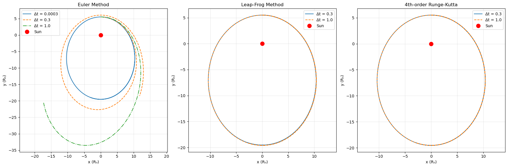
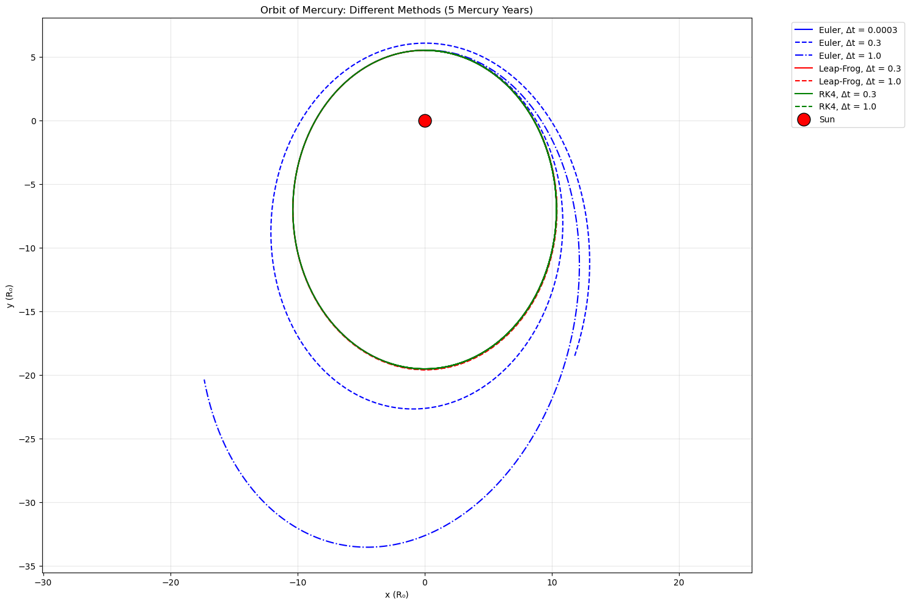
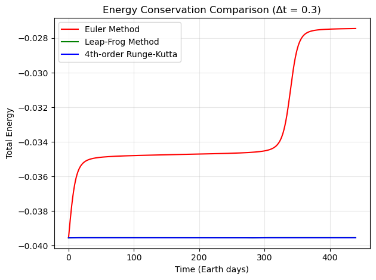

# 水星轨道数值模拟：牛顿引力下的积分器性能比较

## 1. 物理背景与单位制

为研究水星绕太阳的轨道运动，我们采用二维平面下的牛顿引力定律。在自然单位制中，长度以 $R_0 = 10^{10}  \text{m}$ 为单位，时间以 $T_0 = 1$ 地球日为单位。代码中设置 $R_0 = 1$、 $T_0 = 1$ ，所有物理量均为无量纲数值。

太阳的史瓦西半径定义为

$$
r_s = \frac{2 G_N M_{\rm sun}}{c^2} = 2.95 \times 10^{-7}  R_0
$$

由此可将牛顿引力加速度改写为

$$
\ddot{\vec{r}} = -\frac{c^2 r_s}{2}  \frac{1}{r^2}  \frac{\vec{r}}{r}
$$

即

$$
\ddot{\vec{r}} = - \frac{c^2 r_s}{2} \frac{\vec{r}}{r^3}
$$

实际计算中，常数 $\frac{c^2 r_s}{T_0^2} = 0.99  R_0^3 / T_0^2$，因此加速度分量可写为

$$
a_x = -0.99  \frac{x}{r^3}, \qquad a_y = -0.99  \frac{y}{r^3}
$$

其中 $r = \sqrt{x^2 + y^2}$。

初始条件（对应水星近日点附近）为

$$
x(0) = 0, \quad y(0) = 5.5  R_0, \quad v_x(0) = 0.53  \frac{R_0}{T_0}, \quad v_y(0) = 0
$$

模拟总时长设为 5 个水星年，即 $5 \times 88.0 = 440$ 地球日。

---

## 2. 数值积分方法

我们比较三种常用常微分方程积分器：

### 2.1 显式欧拉方法 (Euler)

位置与速度同时向前推进，但速度更新采用当前时刻的加速度：

$$
\vec{v}_{n+1} = \vec{v}_n + \vec{a}(\vec{r}_n)  \Delta t
$$

$$
\vec{r}_{n+1} = \vec{r}_n + \vec{v}_n  \Delta t
$$

该方法为一阶精度，能量漂移严重，仅用于对照。

---

### 2.2 跳蛙方法 (Leap‑Frog)

一种辛积分器，速度与位置交错更新，具有良好的能量守恒性。实现时采用半步速度技巧：

1. 计算初始半步速度： $\vec{v}_{1/2} = \vec{v}_0 + \frac{1}{2} \vec{a}_0 \Delta t$
2. 对每一步：
   - 更新位置： $\vec{r}_ {n+1} = \vec{r}_ {n} + \vec{v}_ {n+1/2} \Delta t$ 
   - 计算新加速度： $\vec{a}_ {n+1} = \vec{a}(\vec{r}_ {n+1})$ 
   - 更新半步速度： $\vec{v}_ {n+3/2} = \vec{v}_ {n+1/2} + \vec{a}_ {n+1} \Delta t$ 
   - 存储整步速度： $\vec{v}_ {n+1} = \vec{v}_ {n+3/2} - \frac{1}{2} \vec{a}_ {n+1} \Delta t$ 

该方法为二阶精度，且保持辛结构，适用于长期轨道积分。

---

### 2.3 四阶 Runge‑Kutta 方法 (RK4)

经典的四阶显式龙格‑库塔法，每步计算四个斜率，具有高精度但非辛结构。对于状态量 $(\vec{r}, \vec{v})$，其更新格式为

$$
\begin{aligned}
\vec{k}_1 &= \vec{v}_n, & \vec{l}_1 &= \vec{a}(\vec{r}_n) \\
\vec{k}_2 &= \vec{v}_n + \frac{\Delta t}{2} \vec{l}_1, & \vec{l}_2 &= \vec{a}(\vec{r}_n + \frac{\Delta t}{2} \vec{k}_1) \\
\vec{k}_3 &= \vec{v}_n + \frac{\Delta t}{2} \vec{l}_2, & \vec{l}_3 &= \vec{a}(\vec{r}_n + \frac{\Delta t}{2} \vec{k}_2) \\
\vec{k}_4 &= \vec{v}_n + \Delta t  \vec{l}_3, & \vec{l}_4 &= \vec{a}(\vec{r}_n + \Delta t  \vec{k}_3)
\end{aligned}
$$

最终

$$
\vec{r}_{n+1} = \vec{r}_n + \frac{\Delta t}{6} (\vec{k}_1 + 2\vec{k}_2 + 2\vec{k}_3 + \vec{k}_4)
$$

$$
\vec{v}_{n+1} = \vec{v}_n + \frac{\Delta t}{6} (\vec{l}_1 + 2\vec{l}_2 + 2\vec{l}_3 + \vec{l}_4)
$$

RK4 为四阶精度，误差随步长迅速下降。

---

## 3. 代码实现说明

代码使用 Python 3 和 NumPy、Matplotlib 库。主要函数包括：

- `acc(x, y)`：计算加速度分量，返回 $(a_x, a_y)$ 。
- `euler_method(dt, totT)`：欧拉方法，返回位置和速度数组。
- `leap_frog_method(dt, totT)`：跳蛙方法。
- `rk4_method(dt, totT)`：四阶 Runge‑Kutta 方法。
- `toten(x, y, vx, vy)`：计算总能量（动能 + 势能），其中势能 $U = -\frac{0.99}{r}$ 。

时间步长 $\Delta t$ 按任务要求分别设为：

- 欧拉： $3 \times 10^{-4}$ 、 $3 \times 10^{-1}$、 $1.0$
- 跳蛙： $3 \times 10^{-1}$ 、 $1.0$
- RK4： $3 \times 10^{-1}$ 、 $1.0$

所有模拟均运行 440 地球日，并绘制轨道图（ $x$ ‑ $y$ 平面）以及能量随时间演化图（取 $\Delta t = 0.3$ 统一比较）。

---

## 4. 结果与讨论

### 4.1 轨道形态

从轨道图可以看出：

- **欧拉方法**：当 $\Delta t = 3 \times 10^{-4}$ 时，轨道近似闭合椭圆；当 $\Delta t$ 增大至 $0.3$ 或 $1.0$ 时，轨道迅速发散，能量不守恒导致行星飞离或螺旋坠落。
- **跳蛙方法**：即使 $\Delta t = 1.0$ ，仍能保持稳定的椭圆轨道，仅出现微小的进动误差； $\Delta t = 0.3$ 时结果更准确。
- **RK4 方法**： $\Delta t = 0.3$ 与 $1.0$ 均给出非常光滑且稳定的椭圆轨道，几乎重叠，显示其高精度。

### 4.2 能量守恒

总能量随时间的变化图（ $\Delta t = 0.3$ ）表明：

- 欧拉方法能量单调漂移（增加或减少），不守恒。
- 跳蛙方法能量在小范围内振荡，无长期漂移，体现辛性质。
- RK4 方法能量几乎恒定，波动极小，精度最高。

### 4.3 结论

对于长期轨道积分，跳蛙法和 RK4 均优于显式欧拉。跳蛙法虽为二阶，但因其辛结构，在较大步长下仍保持稳定，适合天体力学模拟；RK4 精度更高，但计算量较大。实际应用中可根据精度需求与计算成本选择。

---

## 5. 运行说明

在 Jupyter Notebook 或 Python 环境中运行本代码，将依次输出：

1. 所有方法在不同步长下的轨道叠加图。
2. 每个方法单独的子图，便于比较步长影响。
3. 能量守恒对比图（ $\Delta t = 0.3$ ）。

所有图形均自动显示。如需保存图片，可在 `plt.show()` 前添加 `plt.savefig()` 命令。
