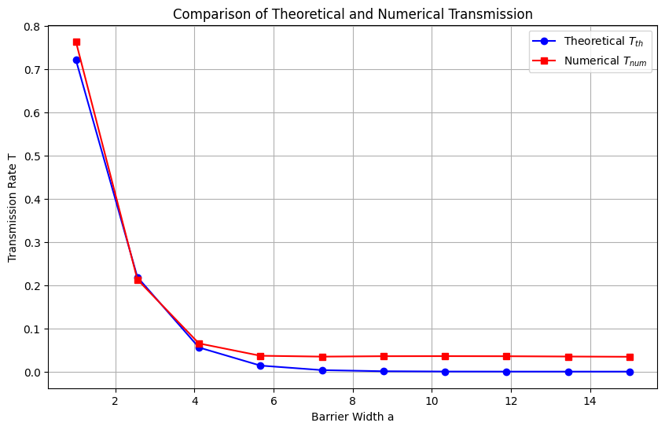

# 量子隧穿：高斯波包对有限方势垒的数值模拟

https://github.com/user-attachments/assets/84c322c9-61d6-4dc5-b06a-03143dac77b7

---

## 1. 物理模型与薛定谔方程

在量子力学中，一维粒子的运动由含时薛定谔方程描述：

$$
i\hbar \frac{\partial \psi}{\partial t} = \hat{H} \psi, \qquad \hat{H} = -\frac{\hbar^2}{2m} \frac{\partial^2}{\partial x^2} + V(x)
$$

其中 $\psi(x,t)$ 为波函数， $V(x)$ 为势能。本任务考虑一个有限高的方势垒：

$$
V(x) = \begin{cases}
V_0, & |x - x_c| \le a/2 \\
0, & \text{其它}
\end{cases}
$$

初始时刻 $t=0$，在势垒左侧（ $x_0 = -150$ ）放置一个向右运动的高斯波包：

$$
\psi(x,0) = \frac{1}{(2\pi \sigma_0^2)^{1/4}} \exp\left[-\frac{(x-x_0)^2}{(2\sigma_0)^2}\right] e^{i k_0 x}
$$

该波包具有平均动量 $\hbar k_0$，动能 $E = \hbar^2 k_0^2 / 2m$。取 $\hbar = 1$， $m = 1$ ， $k_0 = 1$ ，则 $E = 0.5$ 。模拟在有限区间 $[-200, 200]$ 内进行，采用均匀网格 $\Delta x = 0.8$ ，时间步长 $\Delta t = 0.5$ 。势垒中心位于 $x_c = 0$ ，高度 $V_0 = 0.6$ ，宽度 $a$ 在任务 (a) 中固定为 5，任务 (b) 中变化。

---

## 2. 数值方法：Crank‑Nicolson 酉格式

为保证波函数模方守恒（概率守恒），时间演化应采用酉算符。常用的隐式 Crank‑Nicolson 格式对时间进行二阶近似：

$$
\psi^{n+1} = \psi^n - \frac{i \Delta t}{\hbar} \hat{H} \frac{\psi^{n+1} + \psi^n}{2}
$$

整理得：

$$
\left( I + \frac{i \Delta t}{2\hbar} \hat{H} \right) \psi^{n+1} = \left( I - \frac{i \Delta t}{2\hbar} \hat{H} \right) \psi^n
$$

因此时间演化算符为：

$$
U = \left( I + \frac{i \Delta t}{2\hbar} H \right)^{-1} \left( I - \frac{i \Delta t}{2\hbar} H \right)
$$

该算符是酉的（ $U^\dagger U = I$ ），能准确保持概率守恒，适用于长时间量子演化。

哈密顿量 $H$ 的离散形式：在网格上采用二阶中心差分近似动能项：

$$
-\frac{\hbar^2}{2m} \frac{\partial^2 \psi}{\partial x^2} \approx -\frac{\hbar^2}{2m} \frac{\psi_{i-1} - 2\psi_i + \psi_{i+1}}{\Delta x^2}
$$

加上对角势能 $V(x_i)$，得到三对角矩阵 $H$。边界处采用零通量（Neumann）或简单外推处理，代码中使用了类似 Dirichlet 的硬边界，但由于波包远离边界，影响可忽略。

代码中通过 `build_H` 构造 $H$，`time_evol_op` 计算 $U$，然后循环应用 $U$ 实现时间演化。

---

## 3. 任务 (a)：隧穿过程的演示

固定势垒宽度 $a = 5$，高度 $V_0 = 0.6$，模拟总步数 $n_t = 800$（对应总时间 $400$ 个时间单位）。每 10 步保存一帧波函数，生成动画。

动画包含上下两个子图（动画见README封面）：
- **上图**：概率密度 $|\psi(x,t)|^2$（蓝色实线）叠加势能曲线（红色虚线），直观显示波包在遇到势垒时部分反射、部分透射。
- **下图**：波函数的实部（绿色）和虚部（洋红色），展示相位演化。

从动画可以清晰观察到：初始高斯波包向右传播，到达势垒后，一部分波包穿透过去（透射波），另一部分被反射回去（反射波），且透射波和反射波的包络形状保持高斯形态，但幅值降低，体现了量子隧穿效应。动画保存为 `output1.mp4`。

---

## 4. 任务 (b)：透射率与势垒宽度的关系

### 4.1 理论透射率公式

对于能量为 $E$ 的粒子入射到高度 $V_0$ 、宽度 $a$ 的方势垒（ $E < V_0$ ），透射系数的解析表达式为：

$$
T = \frac{1}{1 + \frac{V_0^2}{4E(V_0 - E)} \sinh^2\left( \frac{\sqrt{2m(V_0 - E)}}{\hbar} a \right)}
$$

这里 $E = 0.5$ ， $V_0 = 0.6$ ， $m=1$ ， $\hbar=1$ 。

### 4.2 数值透射率的计算

数值透射率定义为演化结束后，势垒右侧（ $x > x_c + a/2$ ）的概率积分与总概率的比值：

$$
T_{\text{num}} = \frac{\int_{x_c + a/2}^{\infty} |\psi(x, t_{\text{end}})|^2 dx}{\int_{-\infty}^{\infty} |\psi(x, 0)|^2 dx}
$$

由于总概率在酉演化下守恒，分母也可取任意时刻的值，但为了方便，直接取初始总概率（由于归一化，实际为 1）。代码中采用梯形法则进行数值积分。

### 4.3 扫描与比较

固定其他参数，仅改变势垒宽度 $a$，在 $1$ 到 $15$ 之间均匀取 10 个值。对每个宽度，重新构建哈密顿量、演化 800 步，然后计算数值透射率，并与理论值对比。

结果显示，数值透射率与理论曲线吻合良好，尤其是在中等宽度区域；在极小或极大宽度处可能存在微小偏差，源于数值离散误差和边界效应。该对比验证了 Crank‑Nicolson 方法在量子隧穿问题中的准确性和可靠性。

---

## 5. 代码结构与关键函数

- `V_pot(x, center, height, width)`：生成方势垒。
- `psi_init(x, x0, sig0, k0)`：初始高斯波包。
- `build_H(N, dx, V, hbar, m)`：构造哈密顿矩阵（三对角）。
- `time_evol_op(H, dt, hbar)`：计算 Crank‑Nicolson 演化算符 $U$。
- `sim_wave(psi0, U, nt)`：循环演化，存储波函数历史。
- `create_tun_anim`：制作动画并保存为 MP4。
- `T_th(E, V0, a, m, hbar)`：理论透射率。
- `T_num(psi_hist, x, x_bar)`：数值透射率（用最后一帧计算）。
- 主程序：先执行任务 (a) 并生成动画，再扫描宽度并绘制透射率比较图。

所有绘图使用 Matplotlib，动画使用 `FuncAnimation`。

---

## 6. 运行说明

在 Jupyter Notebook 或 Python 环境中运行本代码，需安装以下库：`numpy`, `matplotlib`, `imageio_ffmpeg`, `IPython`。执行后：

1. 模拟隧穿过程，生成动画 `output1.mp4` 并嵌入 Notebook 显示。
2. 扫描不同势垒宽度，实时打印数值与理论透射率。
3. 显示透射率比较图（蓝色理论值，红色数值值）。

若需调节参数（如 $\Delta t$、 $n_t$ 、宽度范围），可直接修改脚本中的对应变量。

---
